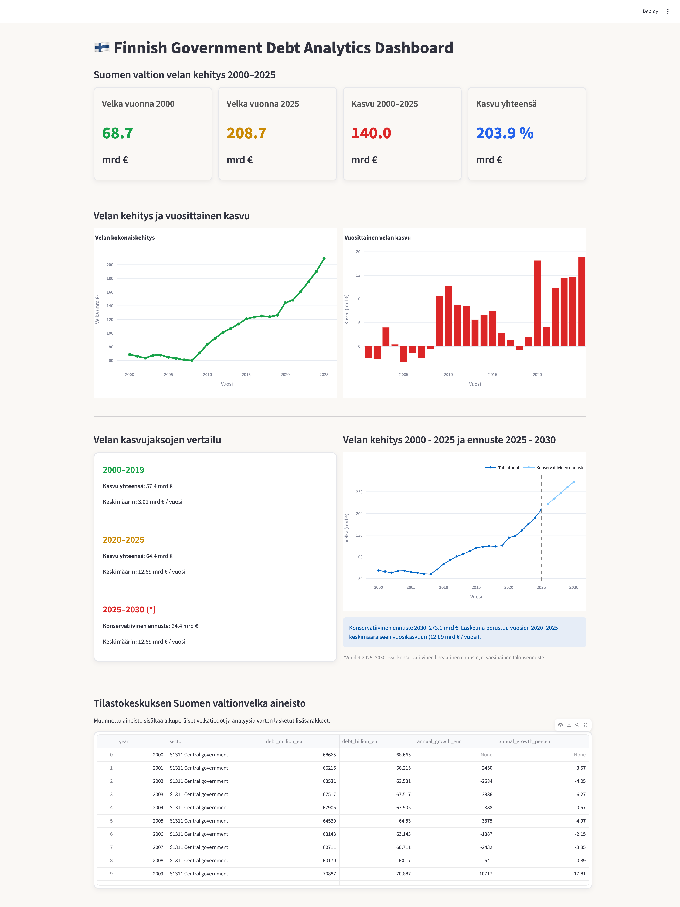

# tehtava_6_finnish-government-debt-dashboard

Tämä projekti on Pythonilla ja Streamlitillä toteutettu data-analytiikka dashboard.

Dashboard visualisoi Suomen valtionvelan kehitystä vuosina 2000–2025 Tilastokeskuksen aineiston pohjalta. Sovellus sisältää tunnusluvut, interaktiiviset kuvaajat, velan kasvun analyysin sekä lineaarisen ennusteen vuoteen 2030.

Käytetyt teknologiat:

- Python
- Pandas
- SQLite
- Streamlit
- Plotly

## Projektin käynnistäminen

1. Siirry projektin juurihakemistoon.
2. Aktivoi Python-virtuaaliympäristö:

source venv/bin/activate

3. Käynnistä Streamlit-sovellus:

streamlit run dashboard/app.py

4. Avaa selain ja siirry osoitteeseen:

http://localhost:8501

---

This project is a data analytics dashboard built with Python and Streamlit.

The dashboard visualizes the development of Finland's central government debt between 2000 and 2025 using data from Statistics Finland (Tilastokeskus). It includes interactive charts, KPI cards, debt growth analysis, and a linear forecast to 2030.

Technologies used:

- Python
- Pandas
- SQLite
- Streamlit
- Plotly

## Running the Project

1. Navigate to the project root directory.
2. Activate the Python virtual environment:

source venv/bin/activate

3. Start the Streamlit application:

streamlit run dashboard/app.py

4. Open your web browser and navigate to:

http://localhost:8501
